# Fibonacci Level Event — Human Review

> **Research-only.** These are auto-detected *candidates*, **not facts** and 
> **not trading signals**. The detector inspects a forward window after each 
> touch, so every label is **post-hoc annotation**, never a live signal. Your 
> job is only to judge whether each auto label matches the chart.

## How to review (mobile-friendly)

For each event below, look at the chart, then fill in three columns in 
`review_sample.csv` (or `review_sample.jsonl`) for the matching `review_id`:

- **human_label** — one of: `agree`, `wrong_type`, `missed_context`, `noise`, `unclear`
- **human_confidence** — one of: `high`, `medium`, `low`
- **human_note** — free text (optional)

### What each human_label means

- `agree` — The auto_candidate type matches what the chart shows.
- `wrong_type` — There is an event here, but it is a different candidate type.
- `missed_context` — Technically a touch, but context (trend/structure) makes it misleading.
- `noise` — Not a meaningful interaction with the level — noise.
- `unclear` — Cannot tell from the chart / ambiguous.

### How to read the chart

- **Dashed blue line** = the fib level price.
- **Orange marker / vertical line** = the event bar (the touch being judged).
- **Purple ▲ / ▼** = swing start / end (the leg the fib is drawn from), when in view.
- The title shows symbol, timeframe, fib level, auto_candidate and event time.

## Summary

- Total candidates available: **2967**
- Total sampled: **40**
- Sampled by candidate type: `{'continuation_candidate': 10, 'failure_candidate': 10, 'reaction_candidate': 10, 'rejection_candidate': 10}`
- Sampled by fib level: `{'0.236': 8, '0.382': 8, '0.5': 8, '0.618': 8, '0.786': 8}`
- Output dir: `C:\Users\fa06662\Projects\Fibonacci-Research-Experiment-main\experiments\review\fib_level_events\review_20260601T152524Z`

## Events

### `BTC-USD_1d_L0p236_s248_e265_b337_rej`

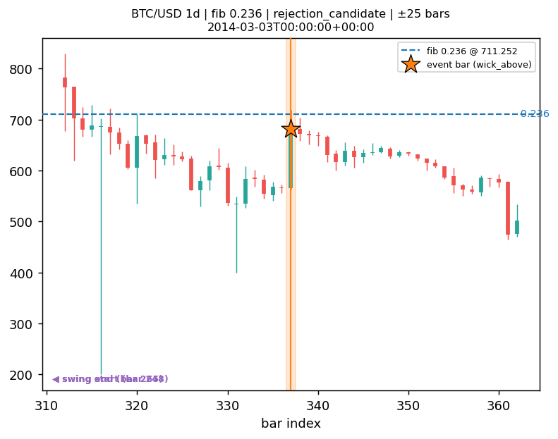

- BTC/USD 1d (bitfinex) | fib **0.236** @ 711.252
- auto_candidate: **rejection_candidate** | touch_type: wick_above | approach_side: below
- event_time: 2014-03-03T00:00:00+00:00 (bar 337)
- evidence: forward_bars=5, closes_beyond=0, closes_back=6, max_penetration_atr=0.0
- swing: down | start 2013-12-04T00:00:00+00:00 → end 2013-12-21T00:00:00+00:00
- **human_label:** ____  **human_confidence:** ____  **human_note:** ____

### `BTC-USD_1d_L0p236_s301_e331_b417_cont`

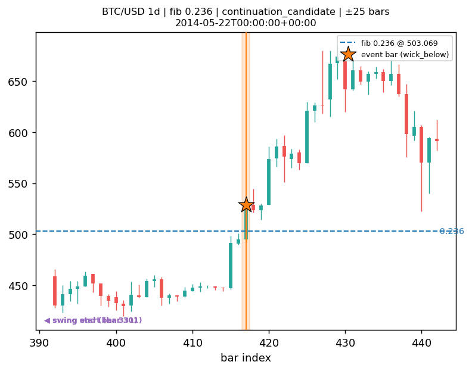

- BTC/USD 1d (bitfinex) | fib **0.236** @ 503.068705
- auto_candidate: **continuation_candidate** | touch_type: wick_below | approach_side: below
- event_time: 2014-05-22T00:00:00+00:00 (bar 417)
- evidence: forward_bars=5, closes_beyond=6, closes_back=0, max_penetration_atr=4.0424
- swing: down | start 2014-01-26T00:00:00+00:00 → end 2014-02-25T00:00:00+00:00
- **human_label:** ____  **human_confidence:** ____  **human_note:** ____

### `BTC-USD_1d_L0p236_s313_e394_b948_rej`

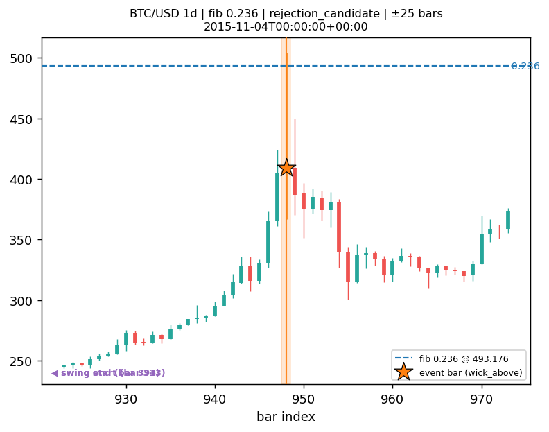

- BTC/USD 1d (bitfinex) | fib **0.236** @ 493.176
- auto_candidate: **rejection_candidate** | touch_type: wick_above | approach_side: below
- event_time: 2015-11-04T00:00:00+00:00 (bar 948)
- evidence: forward_bars=5, closes_beyond=0, closes_back=6, max_penetration_atr=0.0
- swing: down | start 2014-02-07T00:00:00+00:00 → end 2014-04-29T00:00:00+00:00
- **human_label:** ____  **human_confidence:** ____  **human_note:** ____

### `BTC-USD_1d_L0p236_s313_e574_b982_cont`

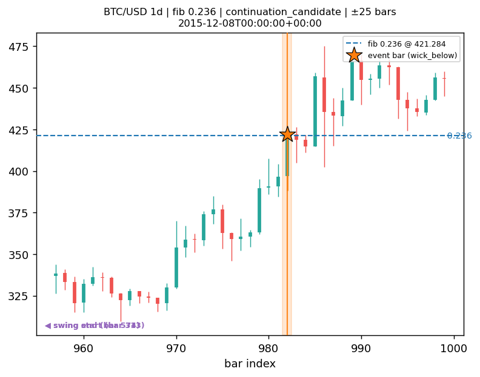

- BTC/USD 1d (bitfinex) | fib **0.236** @ 421.2836
- auto_candidate: **continuation_candidate** | touch_type: wick_below | approach_side: below
- event_time: 2015-12-08T00:00:00+00:00 (bar 982)
- evidence: forward_bars=5, closes_beyond=3, closes_back=2, max_penetration_atr=1.6445
- swing: down | start 2014-02-07T00:00:00+00:00 → end 2014-10-26T00:00:00+00:00
- **human_label:** ____  **human_confidence:** ____  **human_note:** ____

### `BTC-USD_1d_L0p236_s315_e335_b354_react`

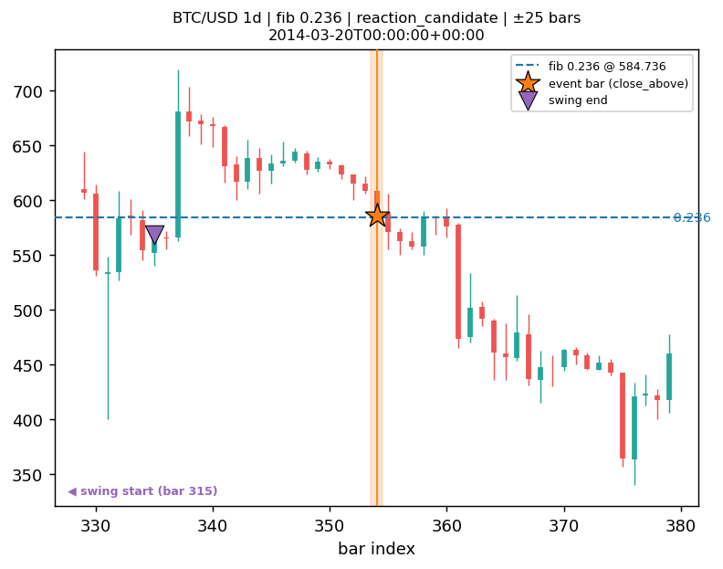

- BTC/USD 1d (bitfinex) | fib **0.236** @ 584.736408
- auto_candidate: **reaction_candidate** | touch_type: close_above | approach_side: above
- event_time: 2014-03-20T00:00:00+00:00 (bar 354)
- evidence: forward_bars=5, closes_beyond=3, closes_back=0, max_penetration_atr=0.7001
- swing: down | start 2014-02-09T00:00:00+00:00 → end 2014-03-01T00:00:00+00:00
- **human_label:** ____  **human_confidence:** ____  **human_note:** ____

### `BTC-USD_1d_L0p236_s337_e376_b536_fail`

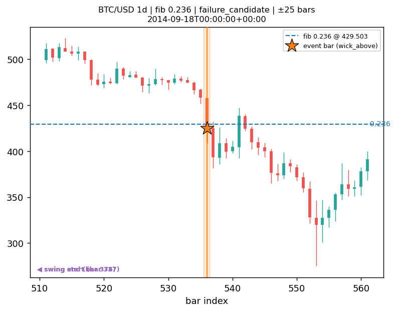

- BTC/USD 1d (bitfinex) | fib **0.236** @ 429.503
- auto_candidate: **failure_candidate** | touch_type: wick_above | approach_side: above
- event_time: 2014-09-18T00:00:00+00:00 (bar 536)
- evidence: forward_bars=5, closes_beyond=5, closes_back=1, max_penetration_atr=2.0186
- swing: down | start 2014-03-03T00:00:00+00:00 → end 2014-04-11T00:00:00+00:00
- **human_label:** ____  **human_confidence:** ____  **human_note:** ____

### `BTC-USD_1d_L0p236_s337_e553_b947_fail`

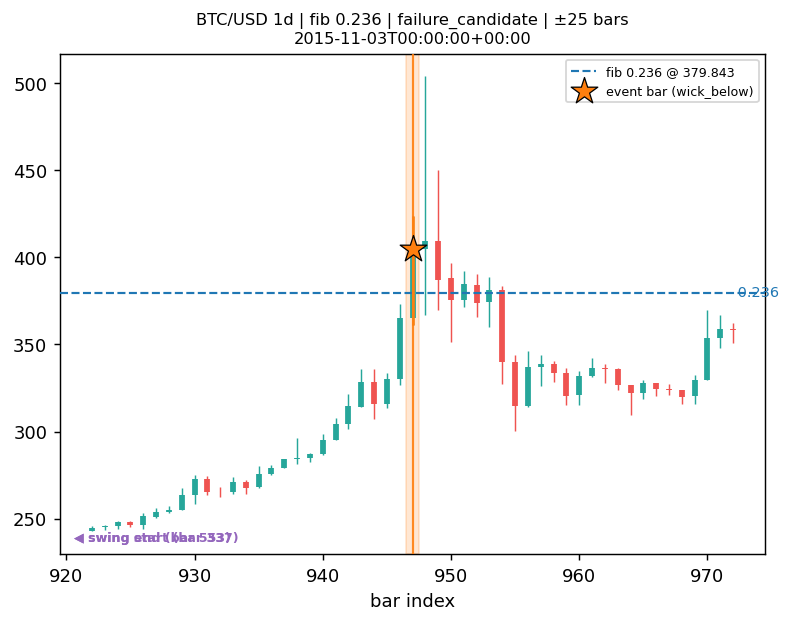

- BTC/USD 1d (bitfinex) | fib **0.236** @ 379.843
- auto_candidate: **failure_candidate** | touch_type: wick_below | approach_side: below
- event_time: 2015-11-03T00:00:00+00:00 (bar 947)
- evidence: forward_bars=5, closes_beyond=4, closes_back=2, max_penetration_atr=1.6412
- swing: down | start 2014-03-03T00:00:00+00:00 → end 2014-10-05T00:00:00+00:00
- **human_label:** ____  **human_confidence:** ____  **human_note:** ____

### `BTC-USD_1d_L0p236_s337_e654_b831_react`

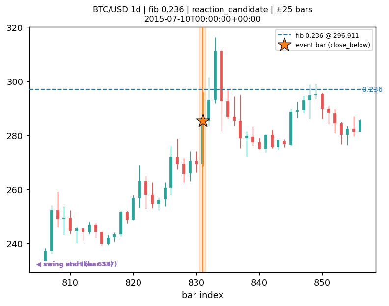

- BTC/USD 1d (bitfinex) | fib **0.236** @ 296.9108
- auto_candidate: **reaction_candidate** | touch_type: close_below | approach_side: below
- event_time: 2015-07-10T00:00:00+00:00 (bar 831)
- evidence: forward_bars=5, closes_beyond=1, closes_back=5, max_penetration_atr=1.4384
- swing: down | start 2014-03-03T00:00:00+00:00 → end 2015-01-14T00:00:00+00:00
- **human_label:** ____  **human_confidence:** ____  **human_note:** ____

### `BTC-USD_1d_L0p382_s205_e224_b685_fail`

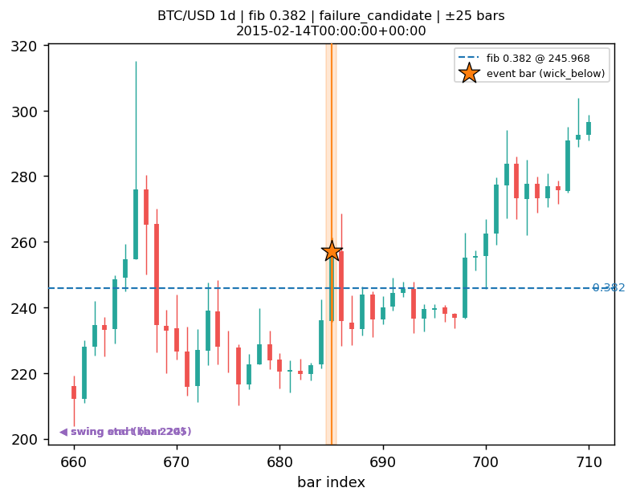

- BTC/USD 1d (bitfinex) | fib **0.382** @ 245.96798
- auto_candidate: **failure_candidate** | touch_type: wick_below | approach_side: below
- event_time: 2015-02-14T00:00:00+00:00 (bar 685)
- evidence: forward_bars=5, closes_beyond=1, closes_back=5, max_penetration_atr=0.5927
- swing: up | start 2013-10-22T00:00:00+00:00 → end 2013-11-10T00:00:00+00:00
- **human_label:** ____  **human_confidence:** ____  **human_note:** ____

### `BTC-USD_1d_L0p382_s251_e257_b292_rej`

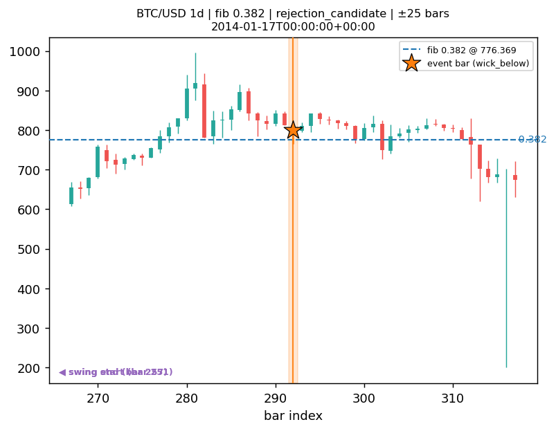

- BTC/USD 1d (bitfinex) | fib **0.382** @ 776.36878
- auto_candidate: **rejection_candidate** | touch_type: wick_below | approach_side: above
- event_time: 2014-01-17T00:00:00+00:00 (bar 292)
- evidence: forward_bars=5, closes_beyond=0, closes_back=6, max_penetration_atr=0.0
- swing: up | start 2013-12-07T00:00:00+00:00 → end 2013-12-13T00:00:00+00:00
- **human_label:** ____  **human_confidence:** ____  **human_note:** ____

### `BTC-USD_1d_L0p382_s316_e396_b588_cont`

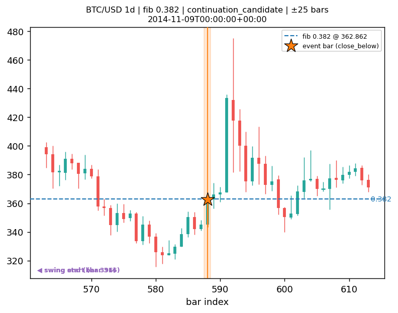

- BTC/USD 1d (bitfinex) | fib **0.382** @ 362.86154
- auto_candidate: **continuation_candidate** | touch_type: close_below | approach_side: below
- event_time: 2014-11-09T00:00:00+00:00 (bar 588)
- evidence: forward_bars=5, closes_beyond=5, closes_back=0, max_penetration_atr=4.0281
- swing: up | start 2014-02-10T00:00:00+00:00 → end 2014-05-01T00:00:00+00:00
- **human_label:** ____  **human_confidence:** ____  **human_note:** ____

### `BTC-USD_1d_L0p382_s316_e702_b735_fail`

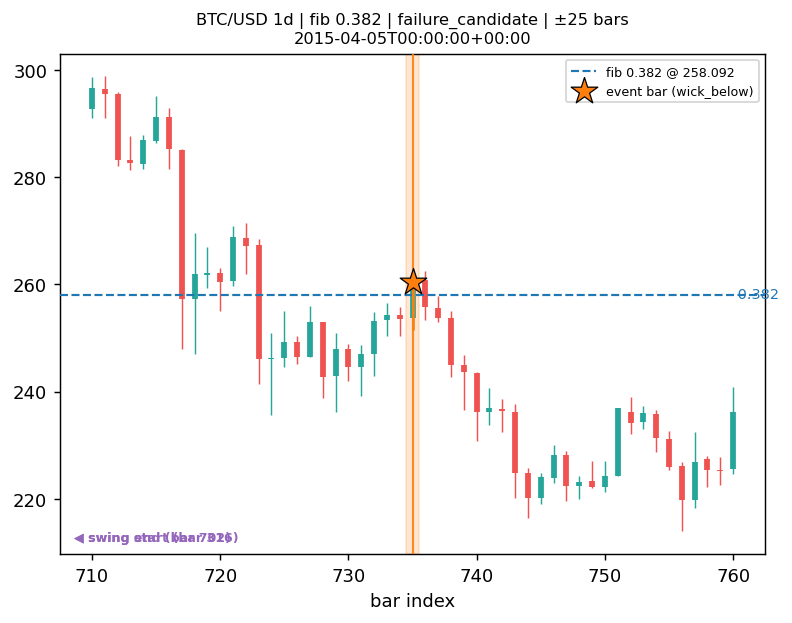

- BTC/USD 1d (bitfinex) | fib **0.382** @ 258.092
- auto_candidate: **failure_candidate** | touch_type: wick_below | approach_side: below
- event_time: 2015-04-05T00:00:00+00:00 (bar 735)
- evidence: forward_bars=5, closes_beyond=1, closes_back=5, max_penetration_atr=0.2075
- swing: up | start 2014-02-10T00:00:00+00:00 → end 2015-03-03T00:00:00+00:00
- **human_label:** ____  **human_confidence:** ____  **human_note:** ____

### `BTC-USD_1d_L0p382_s316_e768_b799_react`

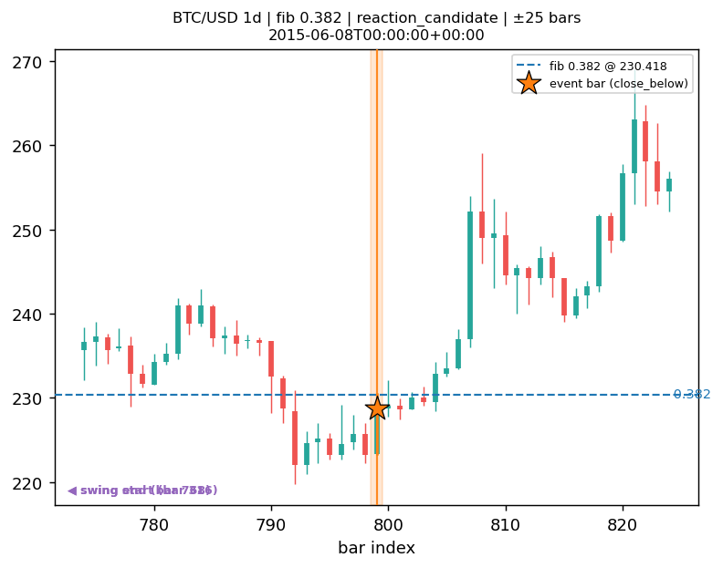

- BTC/USD 1d (bitfinex) | fib **0.382** @ 230.41796
- auto_candidate: **reaction_candidate** | touch_type: close_below | approach_side: below
- event_time: 2015-06-08T00:00:00+00:00 (bar 799)
- evidence: forward_bars=5, closes_beyond=1, closes_back=4, max_penetration_atr=0.4306
- swing: up | start 2014-02-10T00:00:00+00:00 → end 2015-05-08T00:00:00+00:00
- **human_label:** ____  **human_confidence:** ____  **human_note:** ____

### `BTC-USD_1d_L0p382_s337_e378_b514_rej`

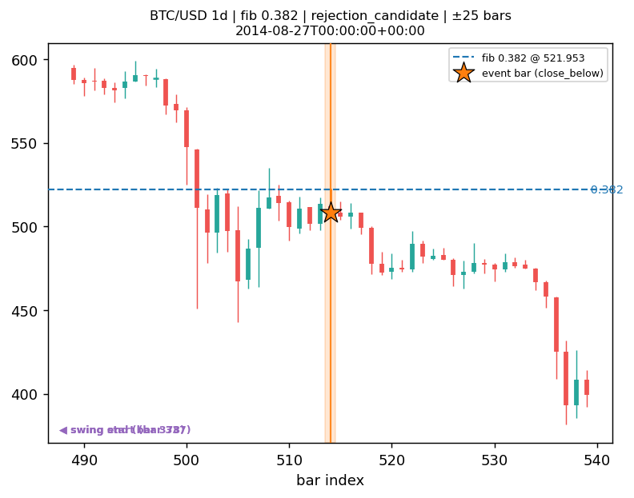

- BTC/USD 1d (bitfinex) | fib **0.382** @ 521.9535
- auto_candidate: **rejection_candidate** | touch_type: close_below | approach_side: below
- event_time: 2014-08-27T00:00:00+00:00 (bar 514)
- evidence: forward_bars=5, closes_beyond=0, closes_back=6, max_penetration_atr=0.0
- swing: down | start 2014-03-03T00:00:00+00:00 → end 2014-04-13T00:00:00+00:00
- **human_label:** ____  **human_confidence:** ____  **human_note:** ____

### `BTC-USD_1d_L0p382_s337_e870_b947_react`

- BTC/USD 1d (bitfinex) | fib **0.382** @ 374.8695
- auto_candidate: **reaction_candidate** | touch_type: wick_below | approach_side: below
- event_time: 2015-11-03T00:00:00+00:00 (bar 947)
- evidence: forward_bars=5, closes_beyond=4, closes_back=0, max_penetration_atr=1.9188
- swing: down | start 2014-03-03T00:00:00+00:00 → end 2015-08-18T00:00:00+00:00
- **human_label:** ____  **human_confidence:** ____  **human_note:** ____

### `BTC-USD_1d_L0p382_s337_e870_b979_cont`

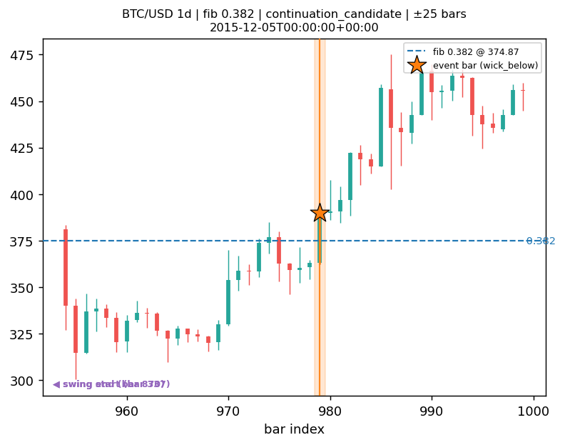

- BTC/USD 1d (bitfinex) | fib **0.382** @ 374.8695
- auto_candidate: **continuation_candidate** | touch_type: wick_below | approach_side: below
- event_time: 2015-12-05T00:00:00+00:00 (bar 979)
- evidence: forward_bars=5, closes_beyond=6, closes_back=0, max_penetration_atr=2.2659
- swing: down | start 2014-03-03T00:00:00+00:00 → end 2015-08-18T00:00:00+00:00
- **human_label:** ____  **human_confidence:** ____  **human_note:** ____

### `BTC-USD_1d_L0p5_s205_e238_b361_react`

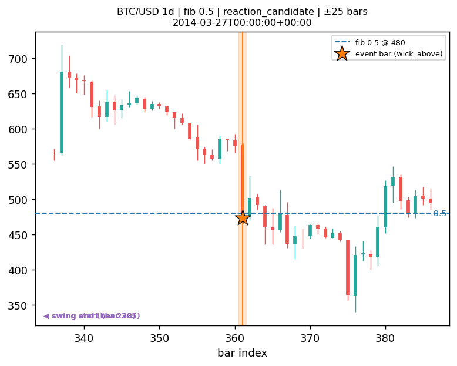

- BTC/USD 1d (bitfinex) | fib **0.5** @ 480.0
- auto_candidate: **reaction_candidate** | touch_type: wick_above | approach_side: above
- event_time: 2014-03-27T00:00:00+00:00 (bar 361)
- evidence: forward_bars=5, closes_beyond=3, closes_back=2, max_penetration_atr=0.57
- swing: up | start 2013-10-22T00:00:00+00:00 → end 2013-11-24T00:00:00+00:00
- **human_label:** ____  **human_confidence:** ____  **human_note:** ____

### `BTC-USD_1d_L0p5_s262_e295_b425_cont`

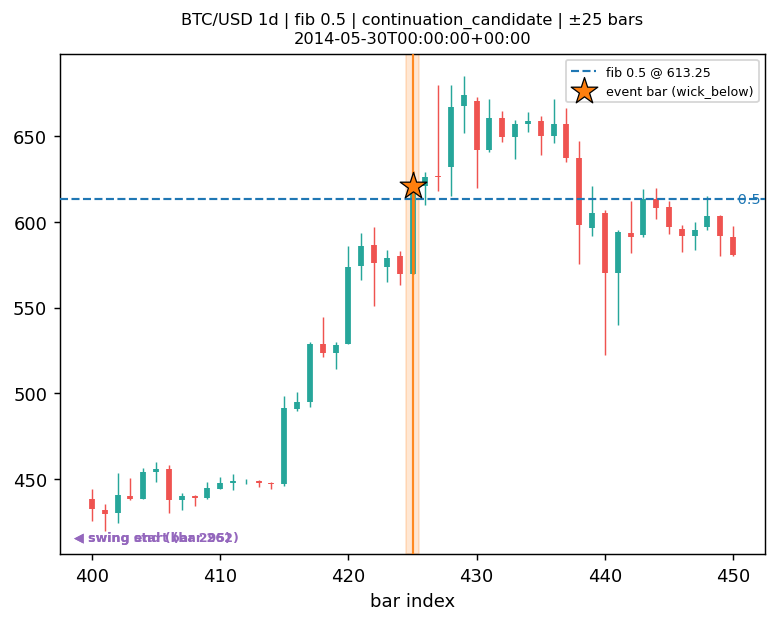

- BTC/USD 1d (bitfinex) | fib **0.5** @ 613.25
- auto_candidate: **continuation_candidate** | touch_type: wick_below | approach_side: below
- event_time: 2014-05-30T00:00:00+00:00 (bar 425)
- evidence: forward_bars=5, closes_beyond=6, closes_back=0, max_penetration_atr=2.2677
- swing: up | start 2013-12-18T00:00:00+00:00 → end 2014-01-20T00:00:00+00:00
- **human_label:** ____  **human_confidence:** ____  **human_note:** ____

### `BTC-USD_1d_L0p5_s316_e329_b375_fail`

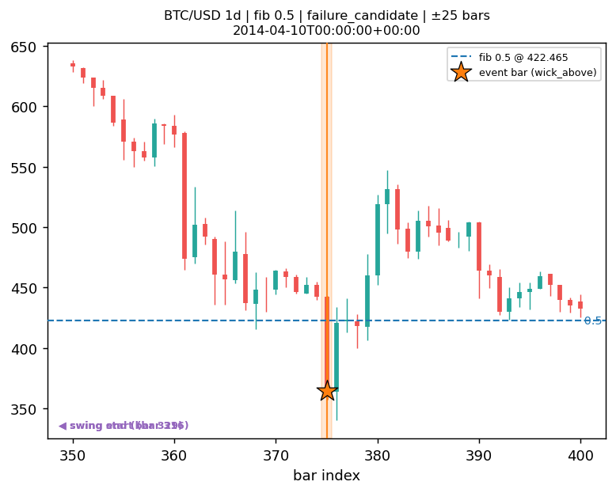

- BTC/USD 1d (bitfinex) | fib **0.5** @ 422.465
- auto_candidate: **failure_candidate** | touch_type: wick_above | approach_side: above
- event_time: 2014-04-10T00:00:00+00:00 (bar 375)
- evidence: forward_bars=5, closes_beyond=2, closes_back=2, max_penetration_atr=1.491
- swing: up | start 2014-02-10T00:00:00+00:00 → end 2014-02-23T00:00:00+00:00
- **human_label:** ____  **human_confidence:** ____  **human_note:** ____

### `BTC-USD_1d_L0p5_s316_e381_b546_react`

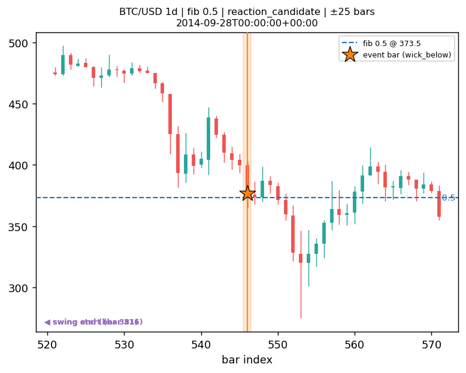

- BTC/USD 1d (bitfinex) | fib **0.5** @ 373.5
- auto_candidate: **reaction_candidate** | touch_type: wick_below | approach_side: above
- event_time: 2014-09-28T00:00:00+00:00 (bar 546)
- evidence: forward_bars=5, closes_beyond=1, closes_back=3, max_penetration_atr=0.5839
- swing: up | start 2014-02-10T00:00:00+00:00 → end 2014-04-16T00:00:00+00:00
- **human_label:** ____  **human_confidence:** ____  **human_note:** ____

### `BTC-USD_1d_L0p5_s316_e566_b647_rej`

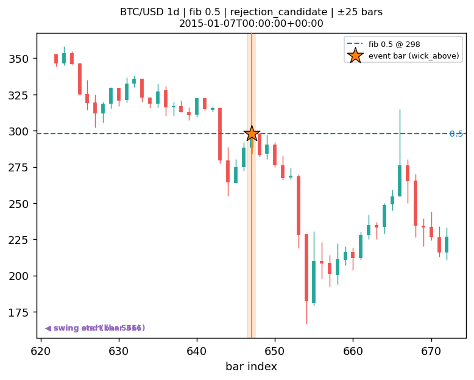

- BTC/USD 1d (bitfinex) | fib **0.5** @ 298.0
- auto_candidate: **rejection_candidate** | touch_type: wick_above | approach_side: below
- event_time: 2015-01-07T00:00:00+00:00 (bar 647)
- evidence: forward_bars=5, closes_beyond=0, closes_back=5, max_penetration_atr=0.0
- swing: up | start 2014-02-10T00:00:00+00:00 → end 2014-10-18T00:00:00+00:00
- **human_label:** ____  **human_confidence:** ____  **human_note:** ____

### `BTC-USD_1d_L0p5_s316_e702_b807_fail`

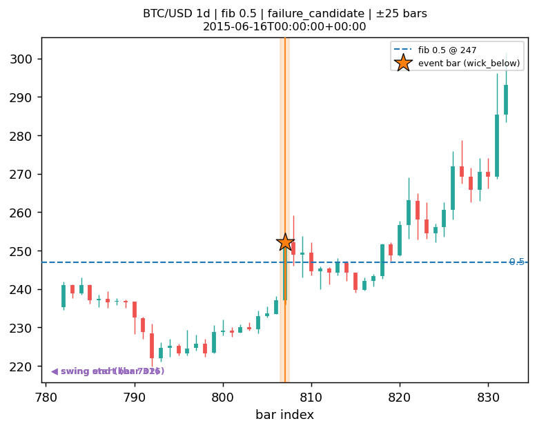

- BTC/USD 1d (bitfinex) | fib **0.5** @ 247.0
- auto_candidate: **failure_candidate** | touch_type: wick_below | approach_side: below
- event_time: 2015-06-16T00:00:00+00:00 (bar 807)
- evidence: forward_bars=5, closes_beyond=3, closes_back=3, max_penetration_atr=0.8932
- swing: up | start 2014-02-10T00:00:00+00:00 → end 2015-03-03T00:00:00+00:00
- **human_label:** ____  **human_confidence:** ____  **human_note:** ____

### `BTC-USD_1d_L0p5_s316_e706_b782_rej`

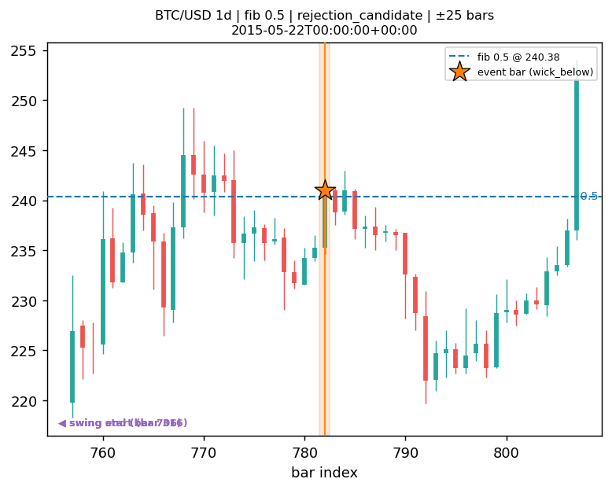

- BTC/USD 1d (bitfinex) | fib **0.5** @ 240.38
- auto_candidate: **rejection_candidate** | touch_type: wick_below | approach_side: below
- event_time: 2015-05-22T00:00:00+00:00 (bar 782)
- evidence: forward_bars=5, closes_beyond=0, closes_back=4, max_penetration_atr=0.0866
- swing: up | start 2014-02-10T00:00:00+00:00 → end 2015-03-07T00:00:00+00:00
- **human_label:** ____  **human_confidence:** ____  **human_note:** ____

### `BTC-USD_1d_L0p5_s59_e70_b149_cont`

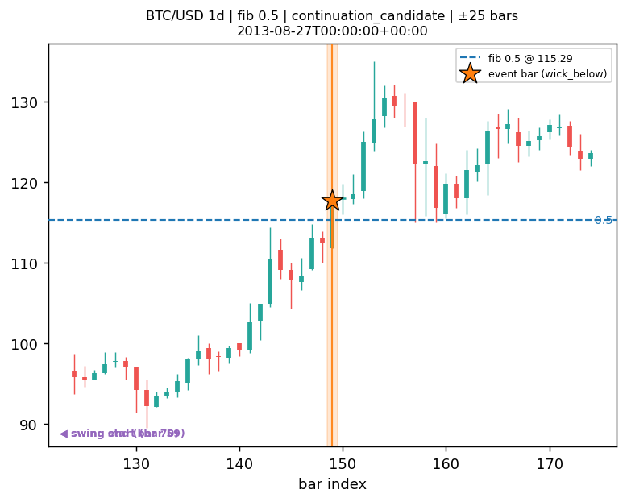

- BTC/USD 1d (bitfinex) | fib **0.5** @ 115.29
- auto_candidate: **continuation_candidate** | touch_type: wick_below | approach_side: below
- event_time: 2013-08-27T00:00:00+00:00 (bar 149)
- evidence: forward_bars=5, closes_beyond=6, closes_back=0, max_penetration_atr=3.102
- swing: down | start 2013-05-29T00:00:00+00:00 → end 2013-06-09T00:00:00+00:00
- **human_label:** ____  **human_confidence:** ____  **human_note:** ____

### `BTC-USD_1d_L0p618_s316_e337_b604_react`

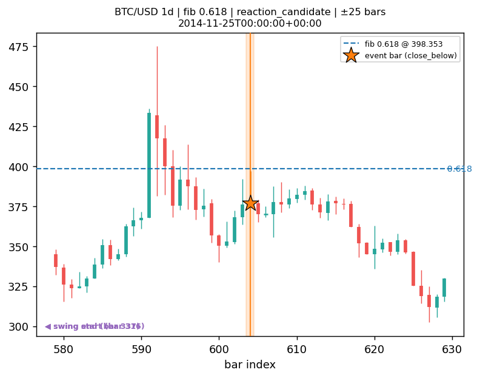

- BTC/USD 1d (bitfinex) | fib **0.618** @ 398.3535
- auto_candidate: **reaction_candidate** | touch_type: close_below | approach_side: below
- event_time: 2014-11-25T00:00:00+00:00 (bar 604)
- evidence: forward_bars=5, closes_beyond=0, closes_back=6, max_penetration_atr=0.0
- swing: up | start 2014-02-10T00:00:00+00:00 → end 2014-03-03T00:00:00+00:00
- **human_label:** ____  **human_confidence:** ____  **human_note:** ____

### `BTC-USD_1d_L0p618_s316_e381_b552_fail`

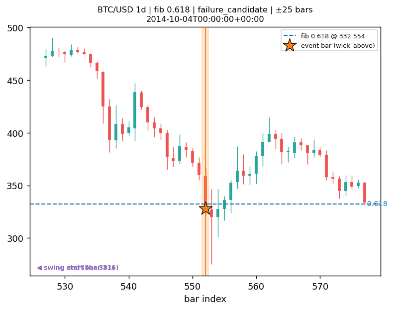

- BTC/USD 1d (bitfinex) | fib **0.618** @ 332.554
- auto_candidate: **failure_candidate** | touch_type: wick_above | approach_side: above
- event_time: 2014-10-04T00:00:00+00:00 (bar 552)
- evidence: forward_bars=5, closes_beyond=3, closes_back=3, max_penetration_atr=0.524
- swing: up | start 2014-02-10T00:00:00+00:00 → end 2014-04-16T00:00:00+00:00
- **human_label:** ____  **human_confidence:** ____  **human_note:** ____

### `BTC-USD_1d_L0p618_s316_e385_b942_cont`

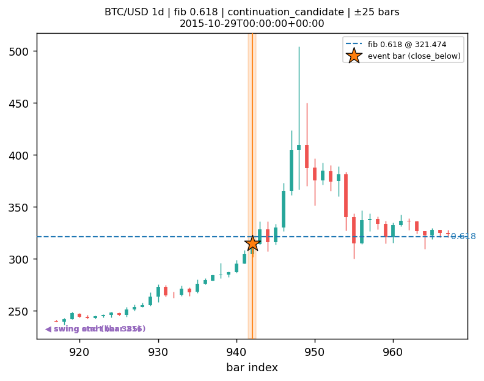

- BTC/USD 1d (bitfinex) | fib **0.618** @ 321.47409
- auto_candidate: **continuation_candidate** | touch_type: close_below | approach_side: below
- event_time: 2015-10-29T00:00:00+00:00 (bar 942)
- evidence: forward_bars=5, closes_beyond=4, closes_back=2, max_penetration_atr=9.1327
- swing: up | start 2014-02-10T00:00:00+00:00 → end 2014-04-20T00:00:00+00:00
- **human_label:** ____  **human_confidence:** ____  **human_note:** ____

### `BTC-USD_1d_L0p618_s316_e396_b955_rej`

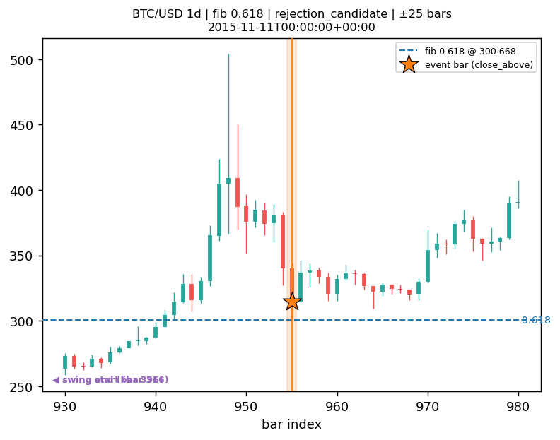

- BTC/USD 1d (bitfinex) | fib **0.618** @ 300.66846
- auto_candidate: **rejection_candidate** | touch_type: close_above | approach_side: above
- event_time: 2015-11-11T00:00:00+00:00 (bar 955)
- evidence: forward_bars=5, closes_beyond=0, closes_back=6, max_penetration_atr=0.0
- swing: up | start 2014-02-10T00:00:00+00:00 → end 2014-05-01T00:00:00+00:00
- **human_label:** ____  **human_confidence:** ____  **human_note:** ____

### `BTC-USD_1d_L0p618_s316_e429_b591_react`

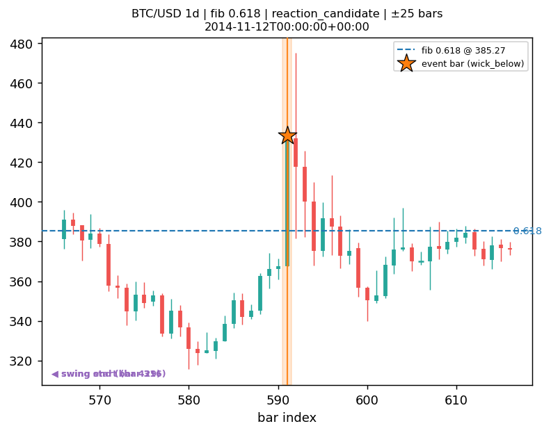

- BTC/USD 1d (bitfinex) | fib **0.618** @ 385.27
- auto_candidate: **reaction_candidate** | touch_type: wick_below | approach_side: below
- event_time: 2014-11-12T00:00:00+00:00 (bar 591)
- evidence: forward_bars=5, closes_beyond=4, closes_back=1, max_penetration_atr=2.3268
- swing: up | start 2014-02-10T00:00:00+00:00 → end 2014-06-03T00:00:00+00:00
- **human_label:** ____  **human_confidence:** ____  **human_note:** ____

### `BTC-USD_1d_L0p618_s316_e666_b698_cont`

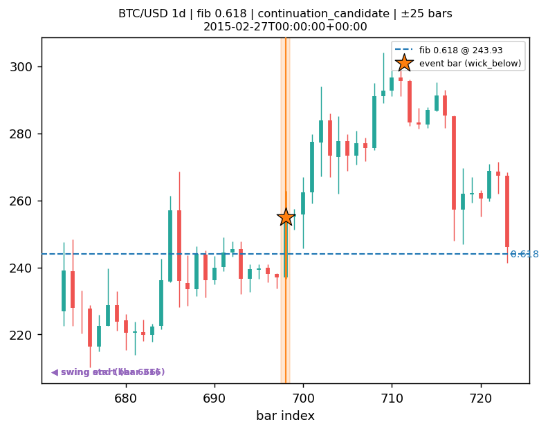

- BTC/USD 1d (bitfinex) | fib **0.618** @ 243.93
- auto_candidate: **continuation_candidate** | touch_type: wick_below | approach_side: below
- event_time: 2015-02-27T00:00:00+00:00 (bar 698)
- evidence: forward_bars=5, closes_beyond=6, closes_back=0, max_penetration_atr=2.7066
- swing: up | start 2014-02-10T00:00:00+00:00 → end 2015-01-26T00:00:00+00:00
- **human_label:** ____  **human_confidence:** ____  **human_note:** ____

### `BTC-USD_1d_L0p618_s316_e698_b905_rej`

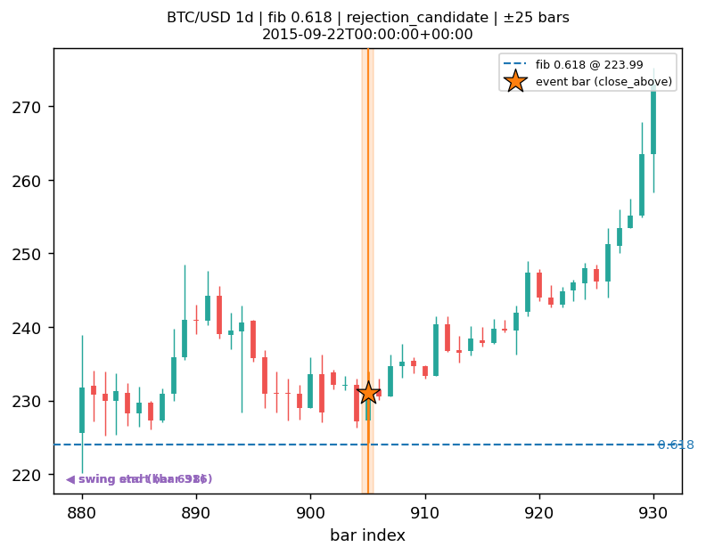

- BTC/USD 1d (bitfinex) | fib **0.618** @ 223.9896
- auto_candidate: **rejection_candidate** | touch_type: close_above | approach_side: above
- event_time: 2015-09-22T00:00:00+00:00 (bar 905)
- evidence: forward_bars=5, closes_beyond=0, closes_back=6, max_penetration_atr=0.0
- swing: up | start 2014-02-10T00:00:00+00:00 → end 2015-02-27T00:00:00+00:00
- **human_label:** ____  **human_confidence:** ____  **human_note:** ____

### `BTC-USD_1d_L0p618_s337_e356_b427_fail`

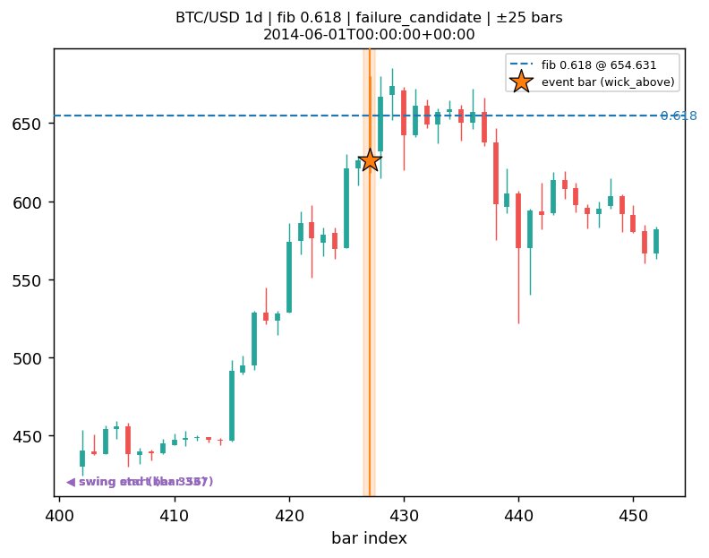

- BTC/USD 1d (bitfinex) | fib **0.618** @ 654.63088
- auto_candidate: **failure_candidate** | touch_type: wick_above | approach_side: below
- event_time: 2014-06-01T00:00:00+00:00 (bar 427)
- evidence: forward_bars=5, closes_beyond=3, closes_back=3, max_penetration_atr=0.6729
- swing: down | start 2014-03-03T00:00:00+00:00 → end 2014-03-22T00:00:00+00:00
- **human_label:** ____  **human_confidence:** ____  **human_note:** ____

### `BTC-USD_1d_L0p786_s205_e245_b376_rej`

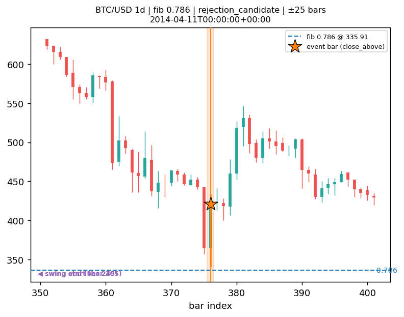

- BTC/USD 1d (bitfinex) | fib **0.786** @ 335.91
- auto_candidate: **rejection_candidate** | touch_type: close_above | approach_side: above
- event_time: 2014-04-11T00:00:00+00:00 (bar 376)
- evidence: forward_bars=5, closes_beyond=0, closes_back=6, max_penetration_atr=0.0
- swing: up | start 2013-10-22T00:00:00+00:00 → end 2013-12-01T00:00:00+00:00
- **human_label:** ____  **human_confidence:** ____  **human_note:** ____

### `BTC-USD_1d_L0p786_s251_e257_b261_react`

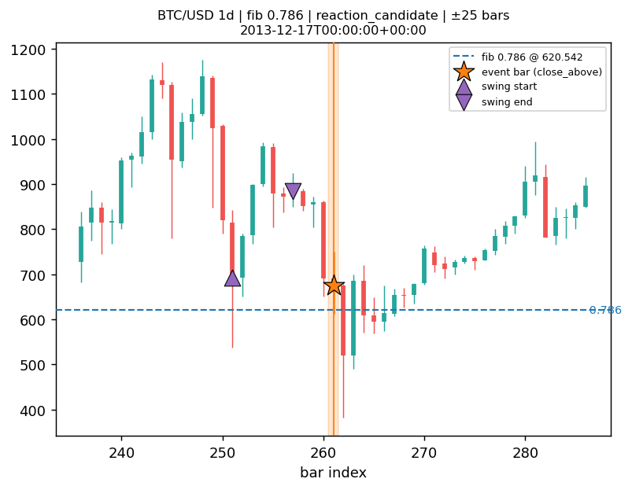

- BTC/USD 1d (bitfinex) | fib **0.786** @ 620.54194
- auto_candidate: **reaction_candidate** | touch_type: close_above | approach_side: above
- event_time: 2013-12-17T00:00:00+00:00 (bar 261)
- evidence: forward_bars=5, closes_beyond=2, closes_back=2, max_penetration_atr=0.7533
- swing: up | start 2013-12-07T00:00:00+00:00 → end 2013-12-13T00:00:00+00:00
- **human_label:** ____  **human_confidence:** ____  **human_note:** ____

### `BTC-USD_1d_L0p786_s262_e301_b501_react`

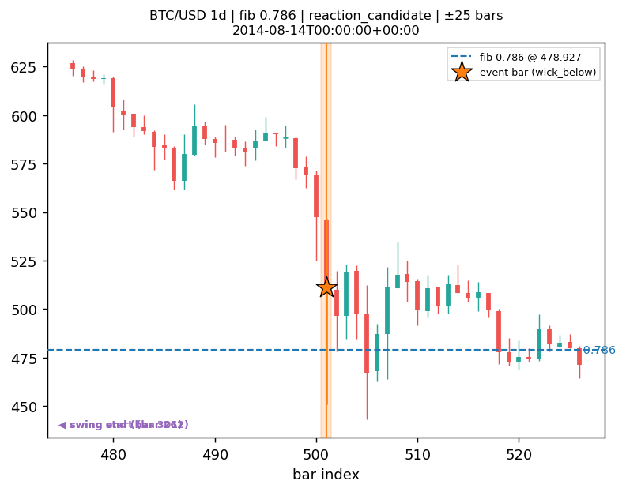

- BTC/USD 1d (bitfinex) | fib **0.786** @ 478.927465
- auto_candidate: **reaction_candidate** | touch_type: wick_below | approach_side: above
- event_time: 2014-08-14T00:00:00+00:00 (bar 501)
- evidence: forward_bars=5, closes_beyond=1, closes_back=5, max_penetration_atr=0.5167
- swing: up | start 2013-12-18T00:00:00+00:00 → end 2014-01-26T00:00:00+00:00
- **human_label:** ____  **human_confidence:** ____  **human_note:** ____

### `BTC-USD_1d_L0p786_s316_e343_b553_rej`

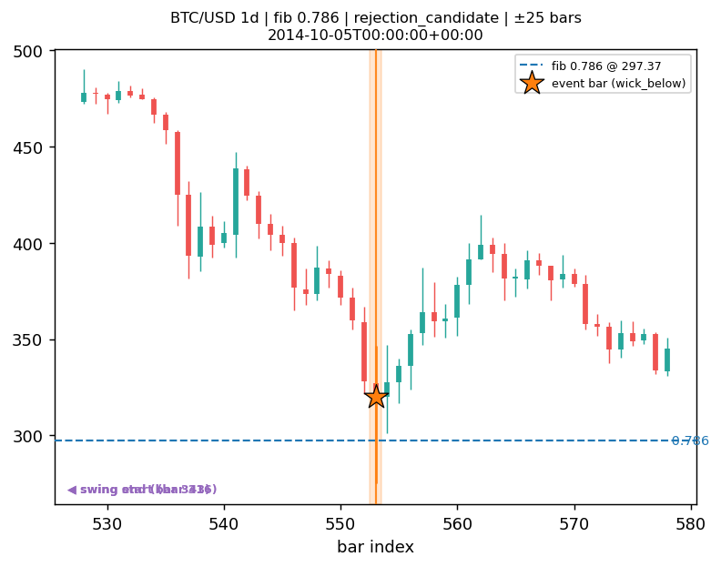

- BTC/USD 1d (bitfinex) | fib **0.786** @ 297.369786
- auto_candidate: **rejection_candidate** | touch_type: wick_below | approach_side: above
- event_time: 2014-10-05T00:00:00+00:00 (bar 553)
- evidence: forward_bars=5, closes_beyond=0, closes_back=6, max_penetration_atr=0.0
- swing: up | start 2014-02-10T00:00:00+00:00 → end 2014-03-09T00:00:00+00:00
- **human_label:** ____  **human_confidence:** ____  **human_note:** ____

### `BTC-USD_1d_L0p786_s316_e514_b826_cont`

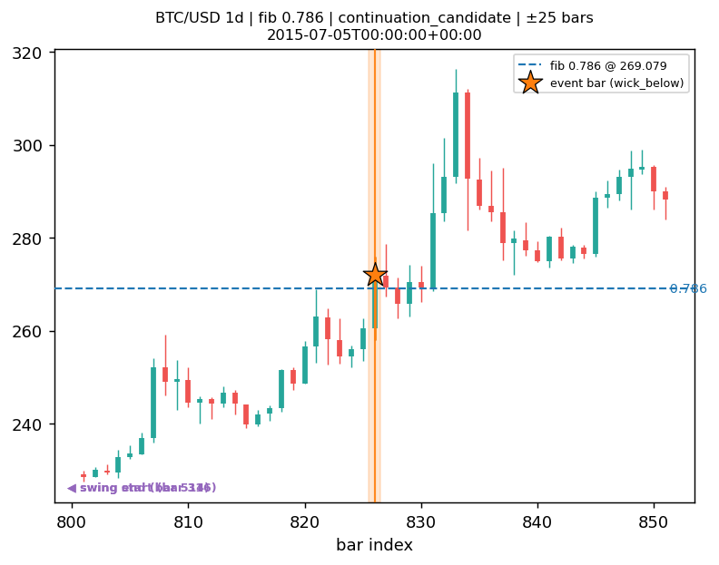

- BTC/USD 1d (bitfinex) | fib **0.786** @ 269.0792
- auto_candidate: **continuation_candidate** | touch_type: wick_below | approach_side: below
- event_time: 2015-07-05T00:00:00+00:00 (bar 826)
- evidence: forward_bars=5, closes_beyond=3, closes_back=1, max_penetration_atr=1.9992
- swing: up | start 2014-02-10T00:00:00+00:00 → end 2014-08-27T00:00:00+00:00
- **human_label:** ____  **human_confidence:** ____  **human_note:** ____

### `BTC-USD_1d_L0p786_s316_e514_b930_cont`

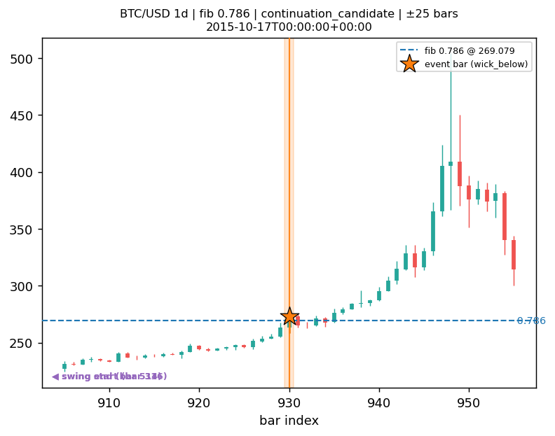

- BTC/USD 1d (bitfinex) | fib **0.786** @ 269.0792
- auto_candidate: **continuation_candidate** | touch_type: wick_below | approach_side: below
- event_time: 2015-10-17T00:00:00+00:00 (bar 930)
- evidence: forward_bars=5, closes_beyond=3, closes_back=3, max_penetration_atr=1.0245
- swing: up | start 2014-02-10T00:00:00+00:00 → end 2014-08-27T00:00:00+00:00
- **human_label:** ____  **human_confidence:** ____  **human_note:** ____

### `BTC-USD_1d_L0p786_s316_e562_b807_fail`

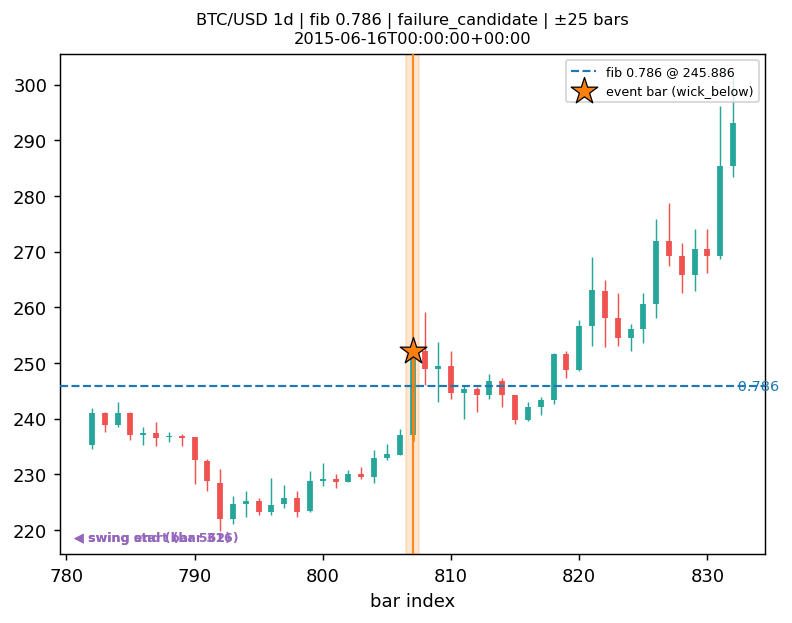

- BTC/USD 1d (bitfinex) | fib **0.786** @ 245.88588
- auto_candidate: **failure_candidate** | touch_type: wick_below | approach_side: below
- event_time: 2015-06-16T00:00:00+00:00 (bar 807)
- evidence: forward_bars=5, closes_beyond=3, closes_back=2, max_penetration_atr=1.0857
- swing: up | start 2014-02-10T00:00:00+00:00 → end 2014-10-14T00:00:00+00:00
- **human_label:** ____  **human_confidence:** ____  **human_note:** ____

### `BTC-USD_1d_L0p786_s316_e855_b876_fail`

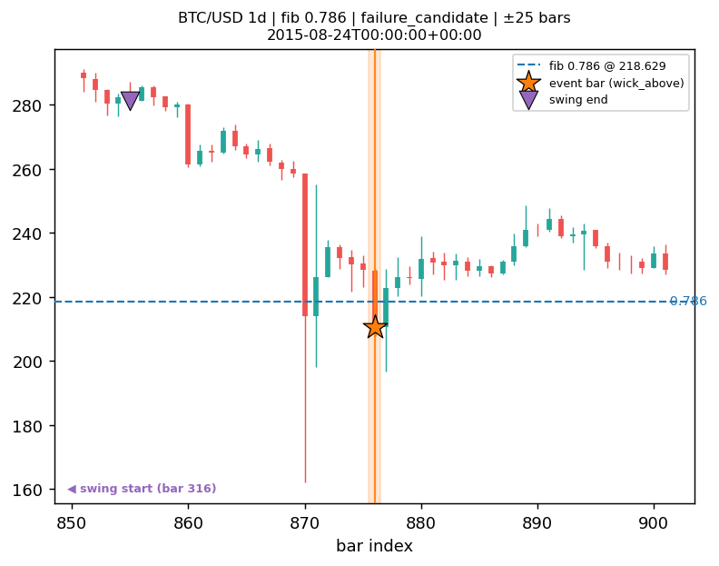

- BTC/USD 1d (bitfinex) | fib **0.786** @ 218.6287
- auto_candidate: **failure_candidate** | touch_type: wick_above | approach_side: above
- event_time: 2015-08-24T00:00:00+00:00 (bar 876)
- evidence: forward_bars=5, closes_beyond=1, closes_back=5, max_penetration_atr=0.514
- swing: up | start 2014-02-10T00:00:00+00:00 → end 2015-08-03T00:00:00+00:00
- **human_label:** ____  **human_confidence:** ____  **human_note:** ____
