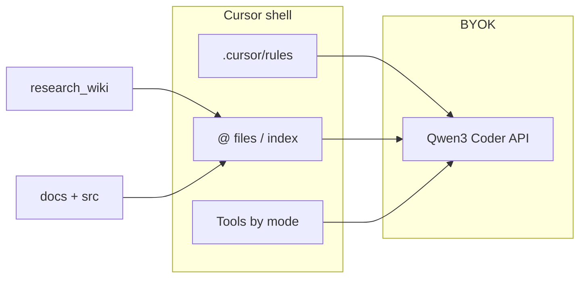

# Configure Cursor workspace: Qwen as a coding agent

**Constitution:** [AGENTS.md](../../AGENTS.md) · **Doc map:** [INDEX.md](INDEX.md)

**Model:** NVIDIA `qwen/qwen3-coder-480b-a35b-instruct` (BYOK).  
**Shell:** Cursor (rules, `@` context, tools).  
**Memory:** [docs/research_wiki/](research_wiki/) — read `index` → `handoff` → `log` first.

This repo is already wired for agent behavior in git. You finish setup in **Cursor Settings** (local).

---

## Architecture



---

## Checklist (do once)

### A. NVIDIA API (BYOK)

1. [build.nvidia.com](https://build.nvidia.com) → API key `nvapi-...`
2. Repo: copy `.env.example` → `.env` (gitignored) or shell `$env:NVIDIA_API_KEY`
3. Smoke: `uv run python scripts/nvidia_qwen_smoke.py`

Details: [research_wiki/reference/nvidia-qwen-api.md](research_wiki/reference/nvidia-qwen-api.md).

### B. Cursor Models

1. **Cursor Settings → Models**
2. **OpenAI API Key** = your `nvapi-...`
3. **Override OpenAI Base URL** = `https://integrate.api.nvidia.com/v1` (no `/chat/completions` suffix)
4. **Add model** = `qwen/qwen3-coder-480b-a35b-instruct` (exact id)
5. **Verify** → Save

### C. Project rules (this repo)

1. **Cursor Settings → Rules, Commands** (or **Rules**)
2. Ensure **project rules** are enabled for this workspace
3. Confirm these show as active (from `.cursor/rules/`):

| Rule | `alwaysApply` |
|------|----------------|
| `repo-aware-coding-agent.mdc` | yes — inspect, wiki first, facts vs assumptions |
| `agent-response-style.mdc` | yes — compact replies |
| `research-wiki-maintenance.mdc` | yes — update wiki after substantial work |

Docs: [Cursor Rules](https://cursor.com/docs/rules).

### D. Optional User Rules (global)

If Chat still ignores repo policy, paste into **Cursor Settings → Rules → User Rules**:

```text
In Fibonacci-Research-Experiment: act as repo-aware coding agent. Read docs/research_wiki (index, handoff, log) before implementation answers. Separate Observed vs Assumptions. Minimal diffs; ask before edit if unclear. Never invent human fib facit.
```

---

## Every coding session

| Step | Action |
|------|--------|
| 1 | **New Chat** (not legacy threads) |
| 2 | Select **Qwen** model in dropdown |
| 3 | Type **`/repo-agent`** (command in `.cursor/commands/repo-agent.md`) or use [prompts/qwen-chat-starter.md](prompts/qwen-chat-starter.md) |
| 4 | Add task `@` paths (e.g. `@src/fibengine/labeling/tool.py`) |
| 5 | For **edits + terminal + search loop** → use **Agent** mode (may use Cursor default model, not BYOK Qwen) |

### Mode matrix (product limits)

| Cursor mode | Typical tools | Qwen BYOK? |
|-------------|---------------|------------|
| **Chat** + Qwen | `@` context, rules; tools vary | **Yes** |
| **Agent / Auto** | Full tool loop | Usually **Cursor models**, not BYOK |
| **Composer / Tab** | Inline / completion | Cursor routing |

So: **Qwen + repo-agent = best for review/plan with wiki**; **Agent = best for multi-step implement** (rules still apply).

---

## Verify agent behavior

**CLI (wiki → Qwen):**

```bash
uv run python scripts/qwen_repo_agent_check.py
```

Expect sections: `Inspected:` / `Observed:` / `Assumptions:`.

**In Chat:** after `/repo-agent`, ask: *What is current focus in handoff?* — answer must cite handoff, not generic fib advice.

---

## Hooks (auto when Qwen is selected)

Project hooks in [`.cursor/hooks.json`](../.cursor/hooks.json):

| Event | Script | Behavior |
|-------|--------|----------|
| `sessionStart` | `on_qwen_session.py` | If `model` contains `qwen` → set `FIB_QWEN_REPO_AGENT=1` and inject handoff + repo-agent policy (`additional_context`) |
| `beforeSubmitPrompt` | `on_qwen_prompt.py` | If Qwen and prompt lacks `/repo-agent`, wiki `@`, or `Repo-aware` → block with short nudge |

**Enable:** Cursor Settings → **Hooks** — confirm project hooks load (restart Cursor after first add).

**Test locally:**

```powershell
'{"model":"qwen/qwen3-coder-480b-a35b-instruct"}' | python .cursor/hooks/on_qwen_session.py
```

**Caveat:** Some Cursor builds drop `sessionStart` `additional_context` (known product bug). The `beforeSubmitPrompt` gate and `alwaysApply` rules still apply. Check **Hooks** output channel if injection seems missing.

To disable the send-time gate only, remove the `beforeSubmitPrompt` entry from `hooks.json`.

## Repo files (already committed)

- `.cursor/rules/*.mdc` — agent policy
- `.cursor/hooks.json` + `.cursor/hooks/*.py` — Qwen auto bootstrap
- `.cursor/commands/repo-agent.md` — slash command template
- `AGENTS.md` — constitution
- `.github/copilot-instructions.md` — VS Code Copilot parity
- [REPO_AWARE_AGENT.md](REPO_AWARE_AGENT.md) — shorter companion to this page

---

## Troubleshooting

| Symptom | Fix |
|---------|-----|
| Generic answers, no paths cited | Enable project rules; use `/repo-agent`; `@` wiki trio |
| 403 / timeout | Rotate key; `--timeout 600` on smoke; cold start 20–60s |
| “OpenAI” errors with BYOK | Disable unrelated OpenAI models in list; base URL root only |
| No file edits from Chat | Normal — switch to **Agent** or ask for patch text |
| Rules not listed | Open folder at repo root; check `.cursor/rules/*.mdc` exists |

---

## Guardrails (all modes)

- Human fib = facit; machine/`_*_candidate` = not facit without review
- Wiki = synthesis; [concepts/guardrails.md](research_wiki/concepts/guardrails.md) = invariants
