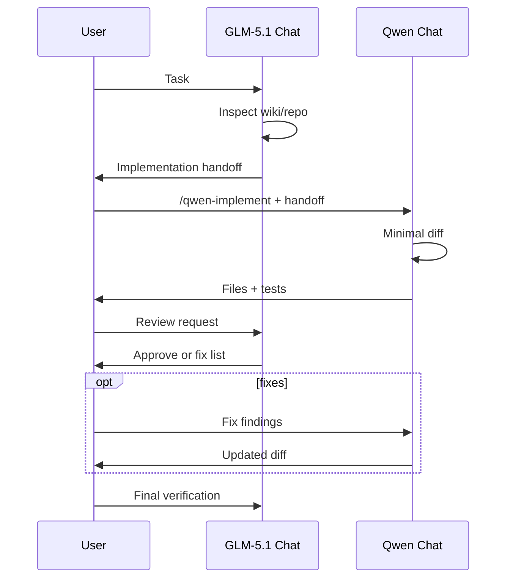

# Model collaboration (GLM-5.1 + Qwen3-Coder)

**Constitution:** [AGENTS.md](../../AGENTS.md) — roles, authority, guardrails (canonical).

**This doc:** operational setup — BYOK, hooks, slash commands, smoke scripts. GLM-5.1
owns plan, review, and approval; Qwen3-Coder owns scoped implementation. Same
`NVIDIA_API_KEY`, same base URL.

| | GLM-5.1 (lead) | Qwen3-Coder (implement) |
|---|----------------|-------------------------|
| **NIM model id** | `z-ai/glm-5.1` | `qwen/qwen3-coder-480b-a35b-instruct` |
| **Catalog** | [build.nvidia.com/z-ai/glm-5.1](https://build.nvidia.com/z-ai/glm-5.1) | [build.nvidia.com/qwen/...](https://build.nvidia.com/qwen/qwen3-coder-480b-a35b-instruct) |
| **API** | [glm5.1 infer](https://docs.api.nvidia.com/nim/reference/z-ai-glm5.1) | [qwen infer](https://docs.api.nvidia.com/nim/reference/qwen-qwen3-coder-480b-a35b-instruct-infer) |
| **Cursor Chat** | New chat, select GLM | **Separate** new chat, select Qwen |
| **Slash command** | `/glm-plan` | `/qwen-implement` |

Base URL (both): `https://integrate.api.nvidia.com/v1`

---

## Cursor BYOK (once)

1. Settings → Models → OpenAI API Key = `nvapi-...`
2. Override base URL → `https://integrate.api.nvidia.com/v1`
3. Add **both** custom models (exact ids above)
4. Enable **project rules** + **hooks** ([CURSOR_WORKSPACE_AGENT.md](CURSOR_WORKSPACE_AGENT.md))

---

## Workflow



1. **GLM chat** — `/glm-plan` or describe task; get handoff (scope, files, tests, out-of-scope).
2. **Qwen chat** — `/qwen-implement`, paste handoff; implement only that scope.
3. **GLM chat** — paste diff summary / ask for review.
4. **Qwen chat** — fix review items if any.
5. **GLM chat** — final sign-off.

**Do not** use one chat for both models. **Do not** let Qwen replan or GLM implement large patches without saying so.

---

## Handoff format

Template: [docs/research_wiki/templates/model-handoff.md](research_wiki/templates/model-handoff.md)

Minimum sections: **Goal**, **In scope**, **Out of scope**, **Files**, **Steps**, **Tests**, **Risks**.

---

## Hooks (automatic)

| Model | Hook | Effect |
|-------|------|--------|
| GLM | `sessionStart` → `on_glm_session.py` | Lead-agent context + handoff template reminder |
| Qwen | `sessionStart` → `on_qwen_session.py` | Implementer-only; requires GLM handoff discipline |
| Qwen | `beforeSubmitPrompt` → `on_qwen_prompt.py` | Blocks send without `/qwen-implement`, handoff markers, or wiki `@` |

---

## CLI smoke

```bash
uv run python scripts/nvidia_glm_smoke.py
uv run python scripts/nvidia_qwen_smoke.py
uv run python scripts/qwen_repo_agent_check.py
```

---

## Subagents (GLM → Qwen)

| Subagent | Model | Role |
|----------|-------|------|
| [`glm-lead`](../.cursor/agents/glm-lead.md) | `z-ai/glm-5.1` | Plan, handoff, review, delegate |
| [`qwen-implementer`](../.cursor/agents/qwen-implementer.md) | `qwen/qwen3-coder-480b-a35b-instruct` | **GLM's implementation subagent** |

**Qwen is GLM's subagent** — not a peer workflow you switch to manually unless subagent delegation fails.

GLM delegates after handoff:

```text
Use the qwen-implementer subagent to implement this GLM handoff:

## GLM handoff
**Goal:** ...
**In scope:** ...
...
```

Subagent frontmatter sets `model:`; BYOK must still be configured once in Cursor Settings (NVIDIA base URL + `nvapi-...` key).

**Fallback:** separate Qwen chat + `/qwen-implement` + paste handoff.

## Related

- [CURSOR_WORKSPACE_AGENT.md](CURSOR_WORKSPACE_AGENT.md)
- [research_wiki/reference/nvidia-qwen-api.md](research_wiki/reference/nvidia-qwen-api.md)
- [research_wiki/reference/nvidia-glm-api.md](research_wiki/reference/nvidia-glm-api.md)
